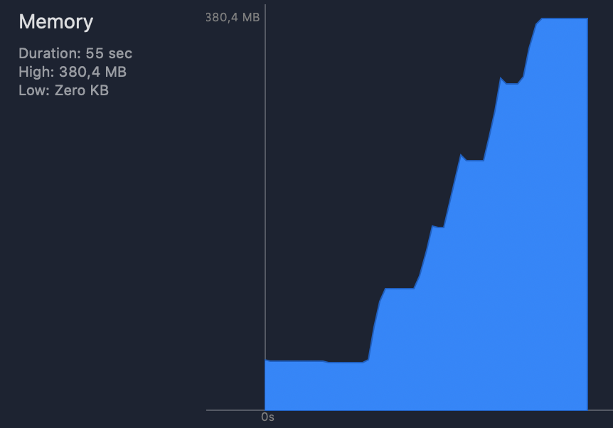
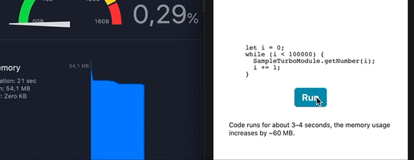

## Repro case for https://github.com/facebook/react-native/issues/27327

This repository serves as an example to illustrate problems encountered when integrating TurboModules on iOS.

It's possible that the current implementation of TurboModules leaks some instances of `NSInvocation`, `NSArray` and `Promise::*Block`s, resulting in memory usage increase of 60 MBs per 100000 calls.

The problem manifests itself when any method is called on a Obj-C++ TurboModule.

### How to use?

1. Clone the repo: `git clone git@github.com:sjchmiela/TurboModulesLeakExample.git`.
2. Install dependencies: `yarn`.
3. Install `Pods`: `cd ios; pod install`
4. Open `TurboLeak.xcworkspace` and run the project: `open TurboLeak.xcworkspace`.
5. Tap `Run` button on the screen, inspect the memory tab in Xcode and see that the memory usage skyrockets.

